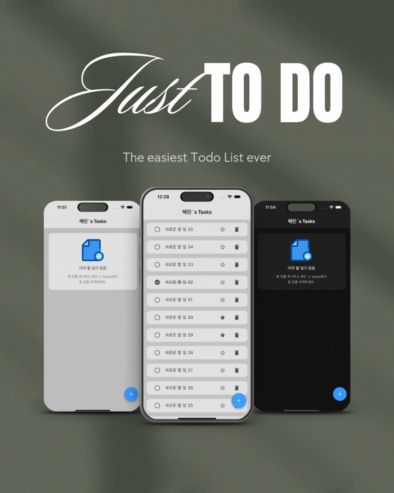

<h1 align="center">
Just To Do
</h1>

  

 

## 🔖 프로젝트 개요
### “Just To Do" 는 누구나 손쉽게 사용 가능한 To Do List 입니다.

#### Just To Do 는 다음과 같은 분들을 위해 탄생되었습니다.

> 해야 할 일들이 정리되지 않아 머릿속이 복잡한 분들
> 

> 간단하게 할 일 목록을 만들고, 수정하고, 완료하고, 삭제하고 싶은 분들
> 

> 복잡한 구조 없는 심플한 투두 리스트를 찾고 있는 분들
> 

      

## 🎨 앱 디자인 설계

  

 

## 📌 주요 기능
1. 제목과 세부 내용(선택) 을 작성해 To Do 생성
2. To Do 목록 확인
3. To Do 를 눌러 세부 내용 확인
4. To Do 완료 여부 표시
5. To Do 즐겨찾기 여부 표시
6. To Do 수정
7. To Do 삭제 

 

## 🛠️ 기술 스택

|구분|사용 기술|
|------|---|
|Flutter|크로스플랫폼 앱 프레임워크|
|Dart|프로그래밍 언어|
|Meterial|UI 디자인 시스템|
|GoRouter|선언적 라우팅|
|RiverPod|상태 관리 (Notifier, Provider)|
|Firebase Core|Firebase 플랫폼 기반|
|Firestore|NoSQL 실시간 데이터베이스|
|Clean Architecture|의존성 역전, 도메인 중심 설계|

 

## 📖 라이브러리

  firebase_core: ^4.2.1 
  cloud_firestore: ^6.1.0 
 
  freezed_annotation: ^3.1.0 
  flutter_hooks: ^0.21.3+1 
  hooks_riverpod: ^3.0.3 
  json_annotation: ^4.9.0 
  riverpod_annotation: ^3.0.3 
  flutter_riverpod: ^3.0.3 
  build_runner: ^2.7.1 
  build: ^3.1.0 
 
  go_router: ^17.0.0 
  tap_debouncer: ^2.2.0 
 
  freezed: ^3.2.3 
  json_serializable: ^6.11.1 
  riverpod_generator: ^3.0.3 
  fake_cloud_firestore: ^4.0.0 

 

## 📂 프로젝트 구조
<pre>
lib/
 ㄴ main                                : 메인 실행 파일
 ㄴ core/
     ㄴ app_theme                       : 앱 전체의 테마 지정 (라이트/다크 모드 지원)
     ㄴ firebase_option                 : firebase 구성파일
     ㄴ fixed_colors                    : 테마 전환에도 변경되지 않는 색 정의 
     ㄴ routes                          : 페이지 라우팅 정의
     ㄴ variable_colors                 : 테마 전환 시 변경되는 색 정의 
 ㄴ data/
     ㄴ data_source/                    : firebase 데이터 가공 (인터페이스)
     ㄴ data_source_impl/               : firebase 데이터 가공 (구현체)
     ㄴ dto/                            : 데이터 전달용 객체
     ㄴ mapper/                         : 매핑을 위한 함수
     ㄴ repository_impl/                : dto - entity 매핑 (구현체)
 ㄴ logic/
     ㄴ entity/                         : 앱 내에서 사용할 model
     ㄴ repository/                     : dto - entity 매핑 (인터페이스)
     ㄴ usecase/                        : 비즈니스 로직
 ㄴ ui/
     ㄴ provider/                       : 의존성 및 상태 관리를 위한 provider
     ㄴ view_model/                     : 상태 관리
     ㄴ view/                           : ui
         ㄴ home/
             ㄴ add_to_do_dialog        : To Do 추가 위젯
             ㄴ home_page               : 홈 페이지
             ㄴ no_to_do                : To Do 가 없을 때 화면에 띄우는 위젯
             ㄴ to_do_view              : To Do 가 있을 때 화면에 띄우는 위젯
         ㄴ to_do_detail/
             ㄴ to_do_detail_page       : 세부 내용 페이지
             
test/       : 테스트 코드
assets/     : 앱 내에서 사용된 이미지 파일
README.md   : 프로젝트 설명 문서
</pre>

 

## 📝 커밋 컨벤션

- feat: 새로운 기능 추가
- fix: 버그 수정
- docs: 문서 수정
- style: 코드 포맷팅, 세미콜론 누락 등
- refactor: 코드 리팩터링
- design: 사용자 UI 디자인 변경
- test: 테스트 코드 추가
- chore: 빌드, 패키지 매니저 등 환경 설정

 

## 👩‍💼 작성자

안혜린
